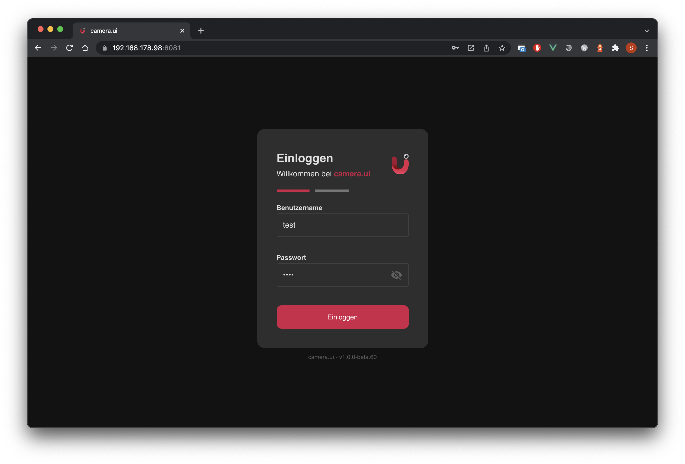
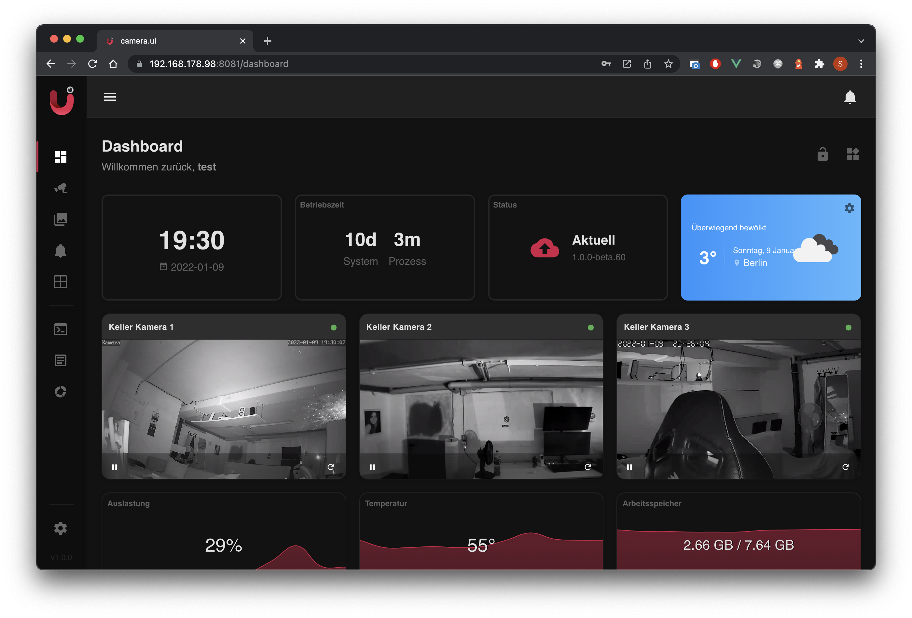
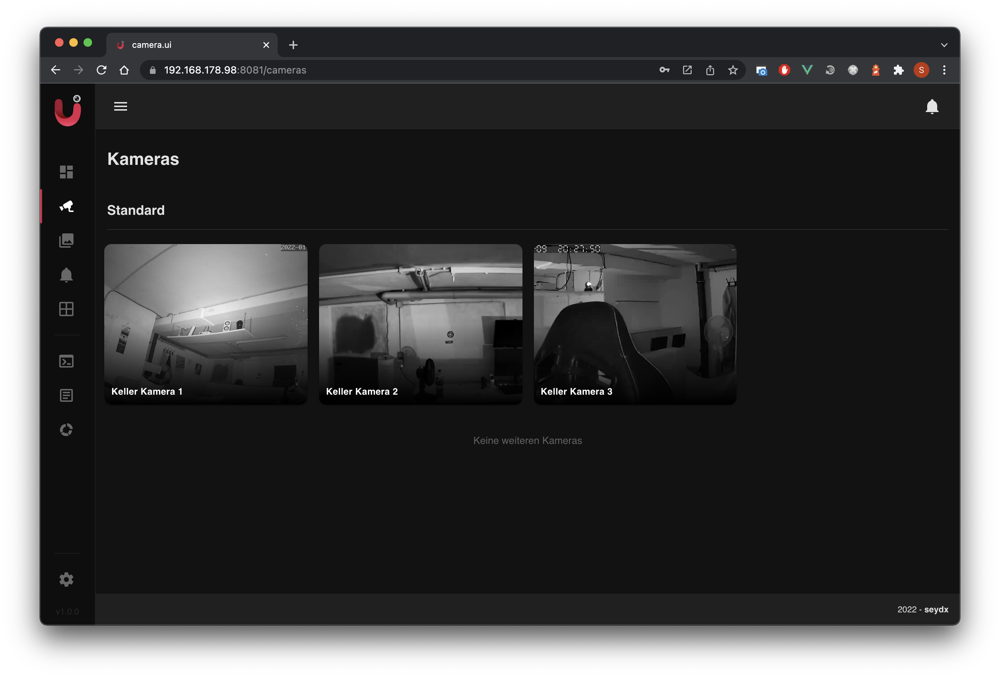
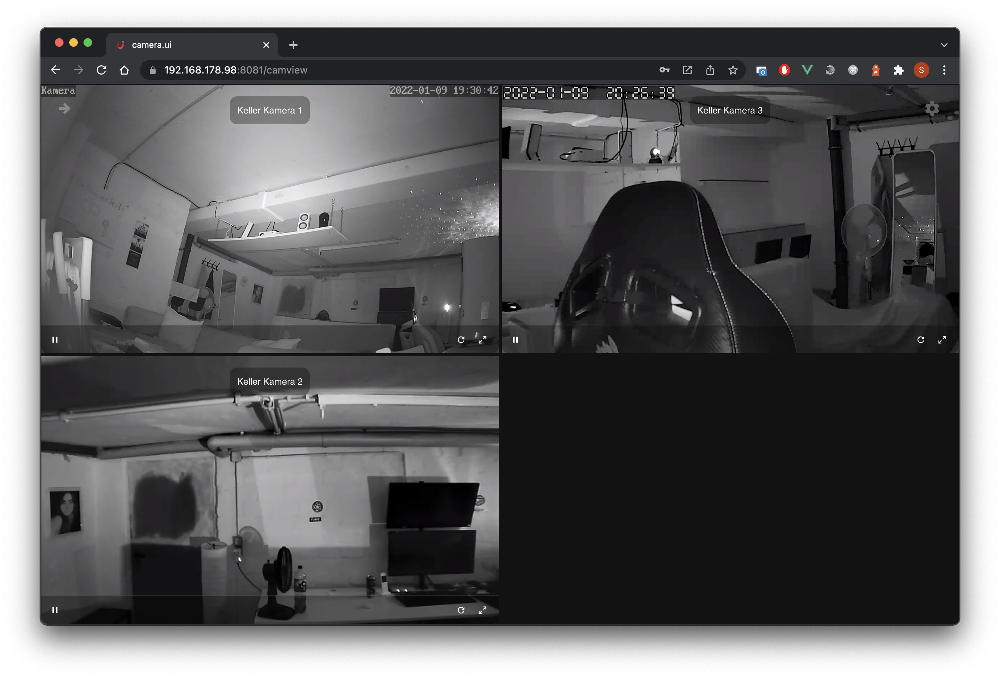
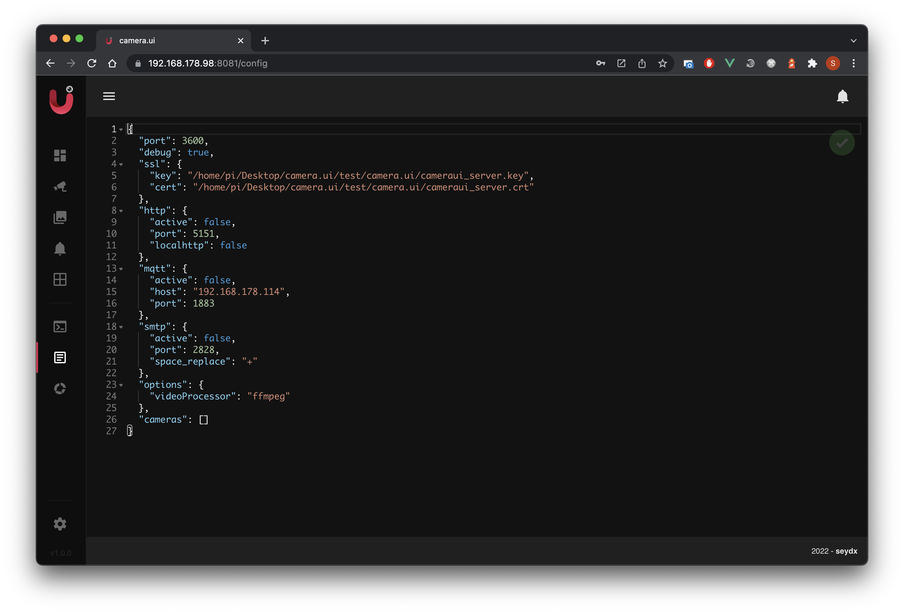
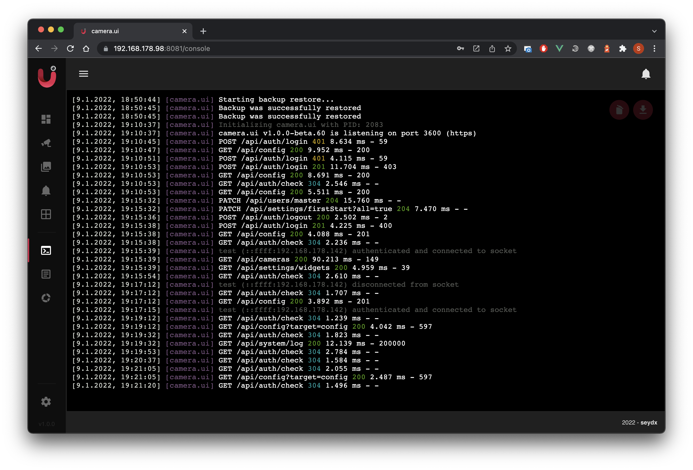
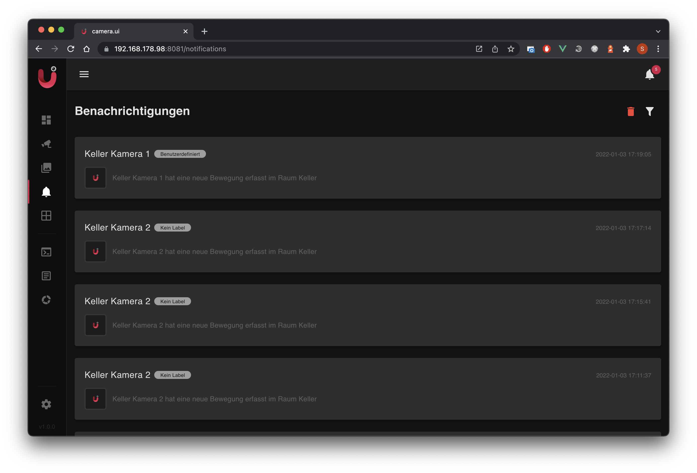
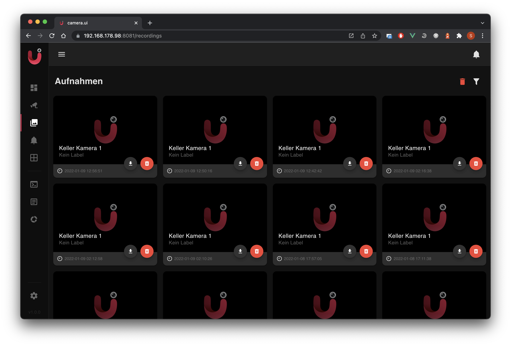
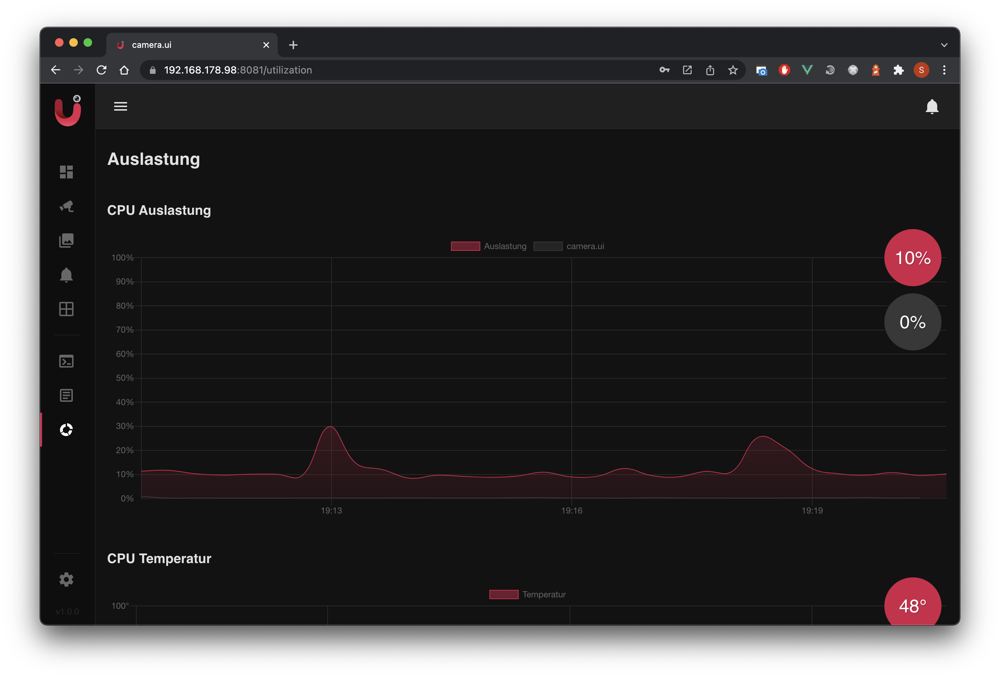

# Segure Vision

Uma plataforma de monitoramento de câmeras com baixa latência, interface web moderna, detecção de movimento, gravações e automação. Construída sobre Node.js (backend) e Vue (frontend), com armazenamento local em JSON (lowdb), pensada para ser simples de instalar, operar e evoluir.

Sumário
- Visão Geral
- Arquitetura
- Instalação e Execução
- Desenvolvimento da UI
- Armazenamento e Dados
- Capturas de Tela
- API e Permissões
- Streaming e Baixa Latência
- Testes
- Backup e Restauração
- Troubleshooting
- Segurança
- Contribuição e Licença

Visão Geral
- Objetivo: disponibilizar uma UI tipo NVR para câmeras RTSP, com foco em baixa latência, gestão de usuários, gravações, notificações e análise básica de movimento.
- Tecnologias-chave: Node.js, Express, lowdb (JSON), JWT, FFmpeg, WebSocket, Vue + Tailwind.

Arquitetura
- Backend (`src/`):
  - Servidor HTTP e APIs em `src/api` (módulos: autenticação, usuários, câmeras, configurações, sistema e backup).
  - Banco de dados local (lowdb) em `database/database.json` via `src/api/database.js`.
  - Autenticação via JWT e middleware de permissões (`auth.validation.middleware.js`, `auth.permission.middleware.js`).
  - Integração com FFmpeg e serviços de câmera (`src/common/ffmpeg.js`, `src/controller/camera/services/*`).
  - WebSocket e eventos do sistema (`src/api/socket.js`) para atualizações em tempo real.
- Frontend (`ui/`):
  - Aplicação Vue com hot‑reload (`npm run serve`), comunicação via REST e exibição de streams em tempo real.
  - Componentes de câmeras e player (ex.: `ui/src/components/camera-card.vue`).
- CLI/Execução:
  - Arquivo de entrada `bin/camera.ui.js` para iniciar o serviço e configurar o armazenamento.
  - Suporte a service mode (ex.: `misc/service/camera.ui.service`).

Instalação e Execução
- Pré‑requisitos: Node.js LTS, npm e FFmpeg instalados e acessíveis no `PATH`.
- Servidor/Serviço:
  - `npm install`
  - `camera.ui` (armazenamento padrão) ou `camera.ui -S "<caminho>"` para definir o diretório de armazenamento.
- Acesso:
  - Interface: `http://localhost:8081/`
  - Credenciais padrão: usuário `master`, senha `master` (será solicitado alterar no primeiro login).

Desenvolvimento da UI
- `cd ui && npm install`
- `npm run serve` para hot‑reload em `http://localhost:8081/`
- Se ocorrer erro OpenSSL (Node 17+): defina `NODE_OPTIONS=--openssl-legacy-provider` durante build/dev.

Armazenamento e Dados
- Diretório padrão: `~/.camera.ui` (Windows: `C:\Users\SEU_USUARIO\.camera.ui`).
- Estrutura:
  - `config.json` — configurações da aplicação
  - `database/database.json` — usuários, câmeras e settings (lowdb)
  - `recordings/` — gravações e snapshots
  - `logs/camera.ui.log` — logs do serviço
- Variáveis de ambiente (gerenciadas pelo serviço/CLI):
  - `CUI_STORAGE_PATH`, `CUI_STORAGE_CONFIG_FILE`, `CUI_STORAGE_DATABASE_FILE`, `CUI_STORAGE_RECORDINGS_PATH`
  - `CUI_LOG_MODE`, `CUI_VERSION`, `CUI_SERVICE_MODE`

Capturas de Tela
Imagens em `images/screenshots`.

API e Permissões
- Autenticação:
  - `POST /api/auth/login` — body `{ "username": "<user>", "password": "<senha>" }`
  - `POST /api/auth/logout` — requer Bearer token
  - `GET /api/auth/check` — status do token
- Usuários:
  - `GET /api/users` — listar (perm.: `users:access`)
  - `GET /api/users/{name}` — obter (mesmo usuário ou admin)
  - `POST /api/users` — criar (perm.: `admin`)
  - `PATCH /api/users/{name}` — atualizar (mesmo usuário ou admin)
  - `DELETE /api/users/{name}` — remover (perm.: `admin`)
- Configurações (Settings):
  - `GET /api/settings`, `GET /api/settings/{target}`
  - `PATCH /api/settings/{target}` (perm.: `settings:edit`)
  - `PUT /api/settings/reset` (perm.: `admin`)
- Sistema/DB:
  - `GET /api/system/db` — informações do `database.json` (perm.: `admin`)
  - `GET /api/system/db/download` — download do banco (perm.: `admin`)
- Backup:
  - `GET /api/backup/download` (perm.: `backup:download`)
  - `POST /api/backup/restore` (perm.: `backup:restore`, multipart `file`)
- Permissões (exemplos): `admin`, `users:access`, `users:edit`, `settings:edit`, `backup:download`, `backup:restore`.

Streaming e Baixa Latência
- Pipeline:
  - FFmpeg captura/transforma o stream da câmera (`src/common/ffmpeg.js`, serviços em `src/controller/camera/services`).
  - Frontend utiliza `JSMpeg.Player` para exibição em tempo real (`ui/src/components/camera-card.vue`).
- Recomendações de baixa latência:
  - Player: `webgl: true`, `pauseWhenHidden: false`, ajustar `videoBufferSize`.
  - FFmpeg: reduzir buffers (`-rtbufsize 512k`), `-flush_packets 1` para escoamento rápido.

Testes
- Testes em `test/__tests__` cobrindo autenticação, usuários, câmeras, settings, backup, etc.
- Script: `npm test` usa Jest com `NODE_OPTIONS=--experimental-vm-modules` (ver `package.json`).
- Boas práticas: adicionar testes para novos endpoints e fluxos críticos.

Backup e Restauração
- Download: `GET /api/backup/download` (exporta todo o ambiente)
- Restauração: `POST /api/backup/restore` (importa arquivo de backup)

Troubleshooting
- OpenSSL em Node 17+: definir `NODE_OPTIONS=--openssl-legacy-provider` durante build/dev da UI.
- Porta `8081` ocupada: liberar ou alterar porta do dev server.
- FFmpeg não encontrado: garantir instalação e presença no PATH.
- CRLF/LF em Windows: ajustar `git config core.autocrlf` conforme necessidade.

Segurança
- Senhas armazenadas com hash (salt + HMAC‑SHA512), não recuperáveis.
- Tokens JWT e permissões por recurso; minimize privilégios.
- Evite expor `database.json`; use endpoints autenticados para download/inspeção.

Contribuição e Licença
- Contribuição: seguir padrões de código, lint e testes; PRs são bem‑vindos.
- Licença: MIT (`LICENSE`).